<html lang="id">
<head>
  <meta charset="utf-8" />
  <meta name="viewport" content="width=device-width,initial-scale=1" />
  <title>SASTIK - Sanggar Seni Tiga Kendari</title>
  <meta name="description" content="Website resmi Sanggar Seni Tiga Kendari (SASTIK) – Sanggar seni tari tradisional dan modern dari Kendari." />
  <link href="https://fonts.googleapis.com/css2?family=Poppins:wght@300;400;600;700&display=swap" rel="stylesheet">
  
</head>
<body>
  <header>
  

    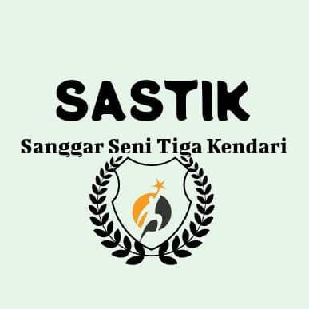
  

  <h1>SASTIK</h1>
  <nav>
      <ul>
        <li><a href="#beranda">Beranda</a></li>
        <li><a href="#profil">Profil</a></li>
        <li><a href="#tarian">Tarian</a></li>
        <li><a href="#galeri">Galeri</a></li>
      </ul>
    </nav>
  </header>
  <section id="beranda" class="hero">
    

      <h2>Sanggar Seni Tiga Kendari (SASTIK)</h2>
      
Tempat kami menyalurkan cinta terhadap budaya dan tarian tradisional. Di SASTIK, menari bukan sekadar gerak, tetapi juga wujud rasa, makna, dan kebersamaan keluarga seni.

    

    

      
    

  </section>

  <section id="profil" class="profil">
    <h2 class="section-title">Profil Sanggar</h2>
    
Menjaga dan melestarikan seni tari tradisional Kendari

    

      
      

        
SASTIK (Sanggar Seni Tiga Kendari) didirikan dengan semangat untuk melestarikan budaya lokal melalui tari. Kami adalah keluarga besar penari muda yang berlatih, tampil, dan berbagi kebahagiaan lewat gerak dan irama.

        
Dengan pelatih berpengalaman dan anggota yang solid, kami telah tampil di berbagai acara budaya dan festival daerah. Kami percaya bahwa setiap gerakan memiliki cerita dan setiap tarian adalah warisan.

      

    

  </section>

  <section id="tarian" class="tarian">
    <h2 class="section-title">Tarian Kami</h2>
    
Karya tari yang pernah kami tampilkan

    

      

        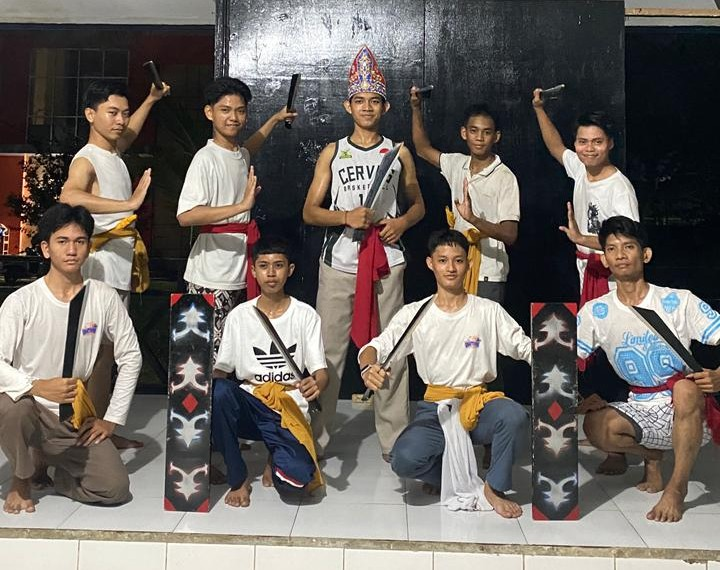
        <h3>Haluoleo</h3>
        
Tari penyambutan khas Sulawesi Tenggara yang menggambarkan kehangatan dan persaudaraan.

      

      

        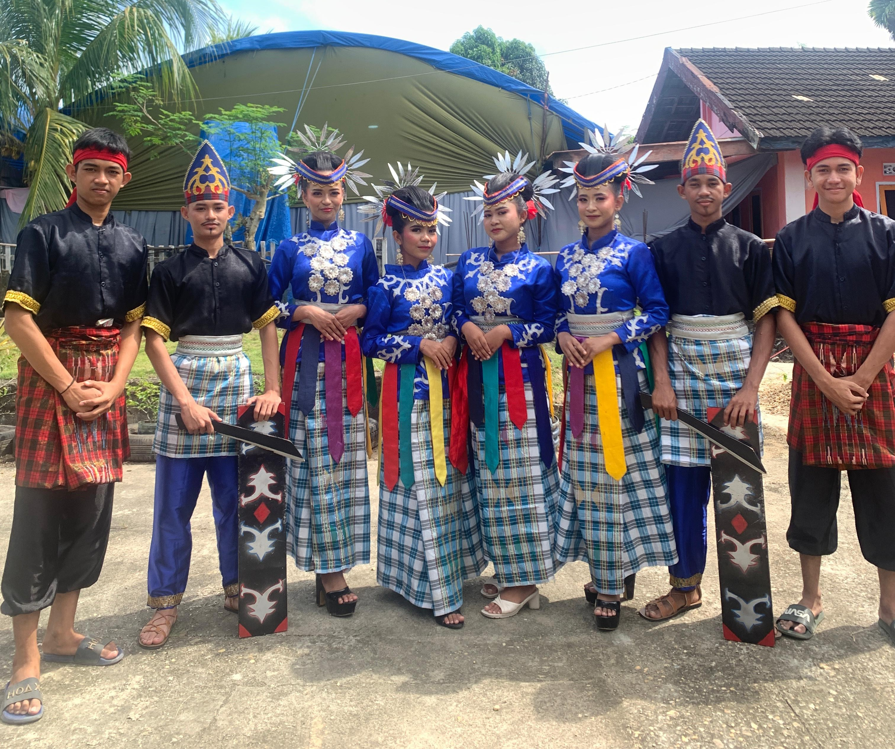
        <h3>Amoara & mondotambe</h3>
        
Tarian kebanggaan SASTIK yang memadukan energi muda dan tradisi daerah dengan gaya elegan.

      

      

        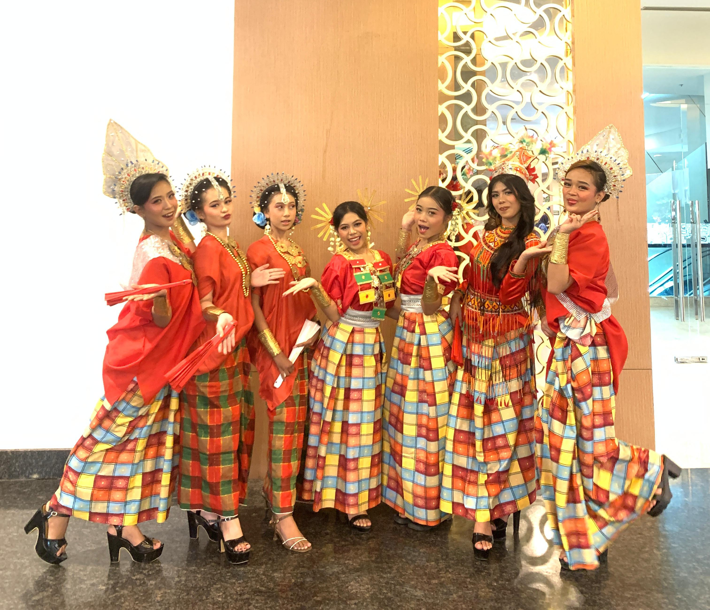
        <h3>4 etnis</h3>
        
Tari 4 Etnis adalah tarian kreasi yang berasal dari Sulawesi Selatan yang memadukan unsur-unsur dari empat etnis terbesar di wilayah tersebut: Bugis, Makassar, Mandar, dan Toraja..

      

      

        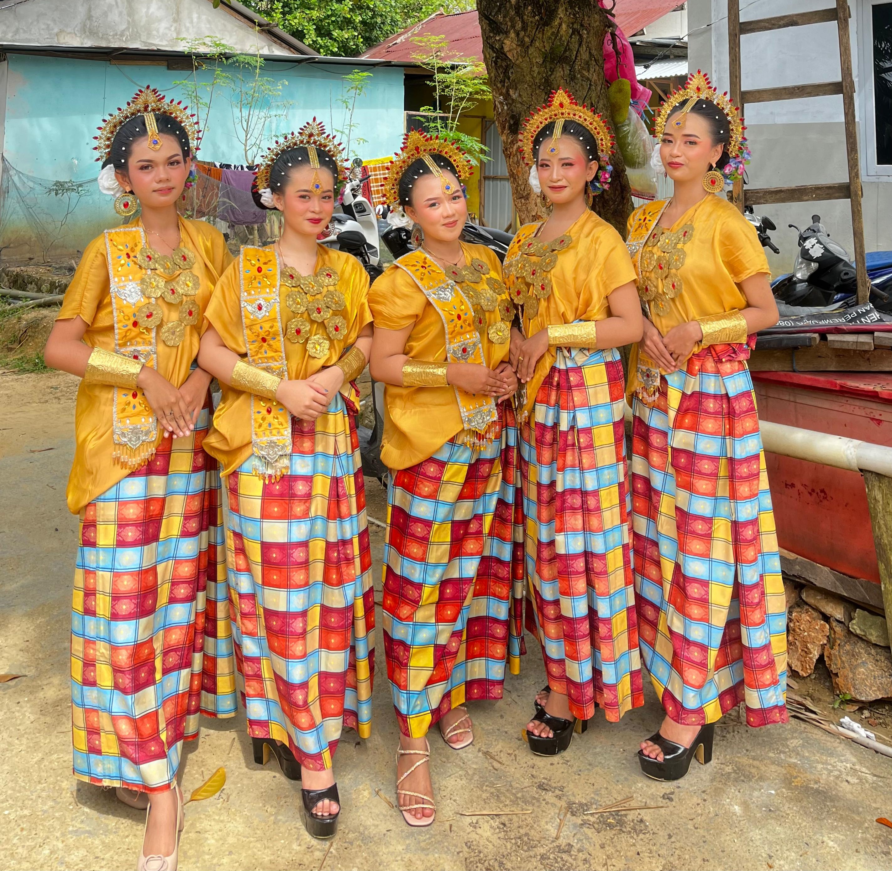
        <h3>paduppa</h3>
        
Tari Paduppa adalah tarian tradisional dari suku Bugis-Makassar yang berfungsi sebagai tarian penyambutan tamu, sering disebut sebagai tarian selamat datang

      

    

  </section>
  

    <input type="radio" name="slider" id="slide-1" checked>
    <input type="radio" name="slider" id="slide-2">
    <input type="radio" name="slider" id="slide-3">
    <input type="radio" name="slider" id="slide-4">
    

        

            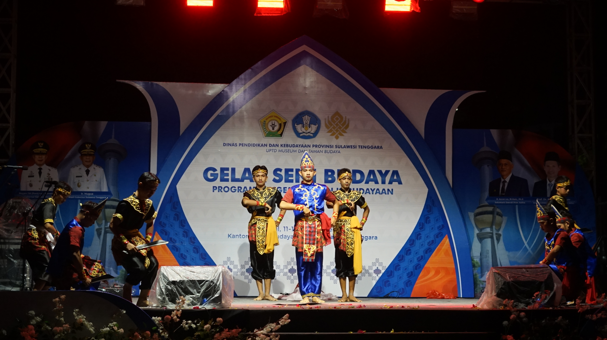
            
SASTIK

        

        

            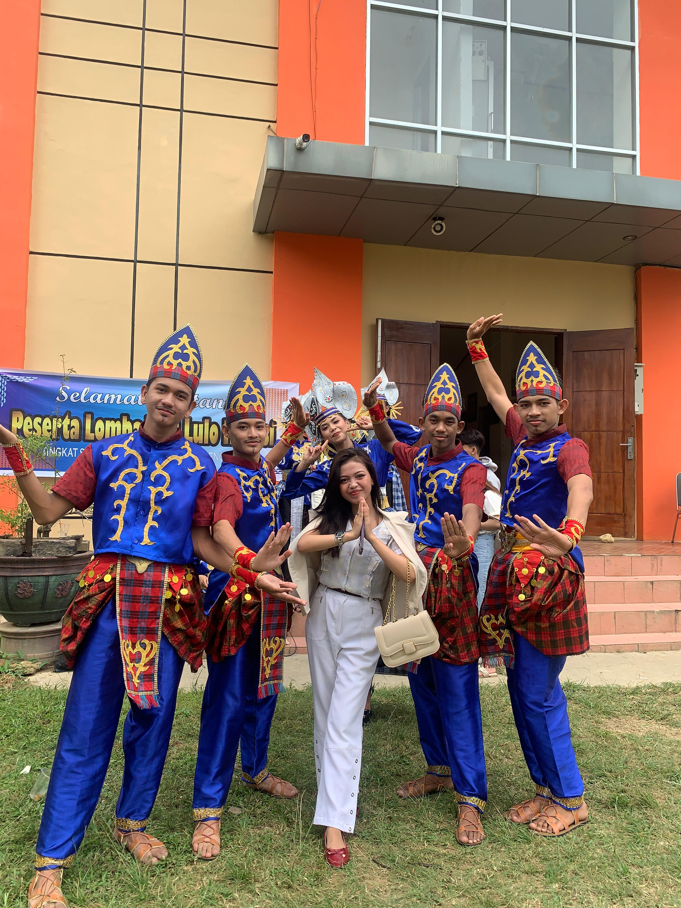
            
SASTIK

        

        

            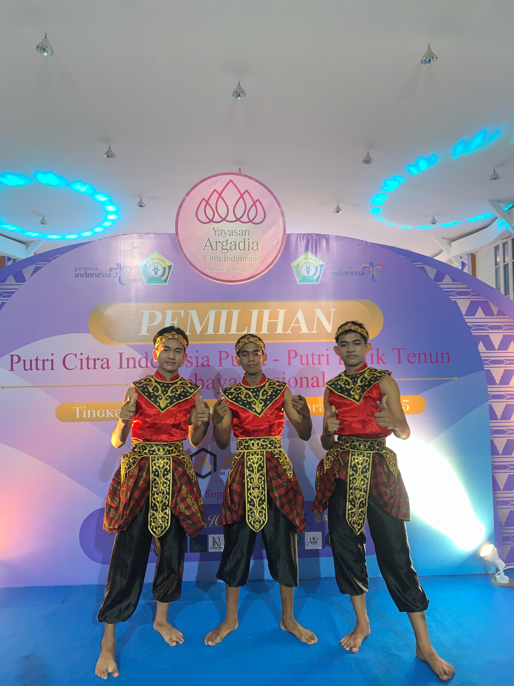
            
SASTIK

        

    
    
    

      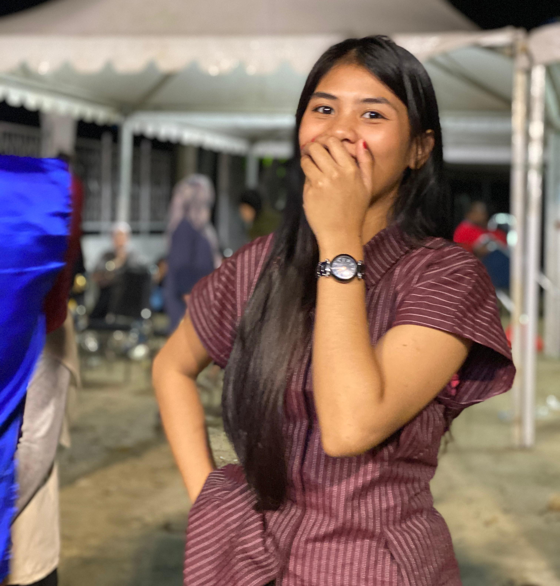
      
SASTIK

    

    

        <label for="slide-1" class="dot"></label>
        <label for="slide-2" class="dot"></label>
        <label for="slide-3" class="dot"></label>
        <label for="slide-4" class="dot"></label>
    

<section id="video" class="video">
  <h2 class="section-title">Nonton Video Kami</h2>
  
Saksikan penampilan tarian kami secara langsung

  

    

      
      
tarian 4 etnis sulawesi selatan yang di bawakan oleh smk n 3 kendari

    

  

</section>

    

      
      
tarian haluoleo yang di bawakan oleh smk n 3 kendari

    

  

</section>

  

    

      
      
tarian lulo tapis yang di bawakan oleh smk n 3 kendari

    

  

  

  
  <section id="galeri" class="galeri">
    <h2 class="section-title">Galeri</h2>
    
Potret kebersamaan dan penampilan kami

    

      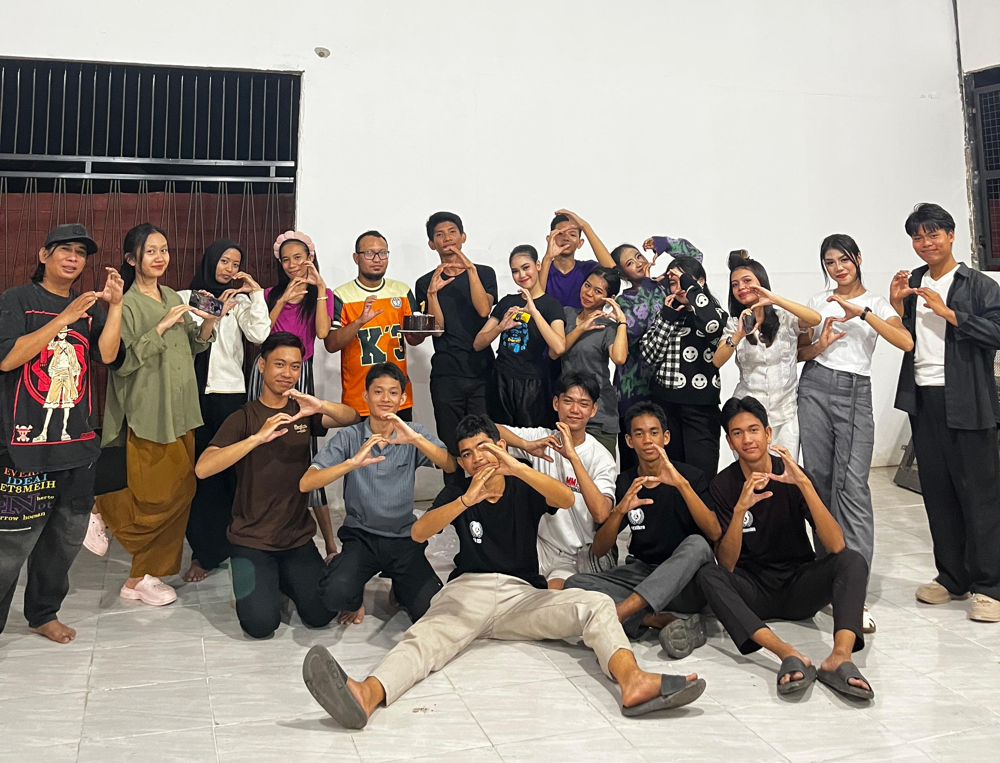
      
      
      
      
      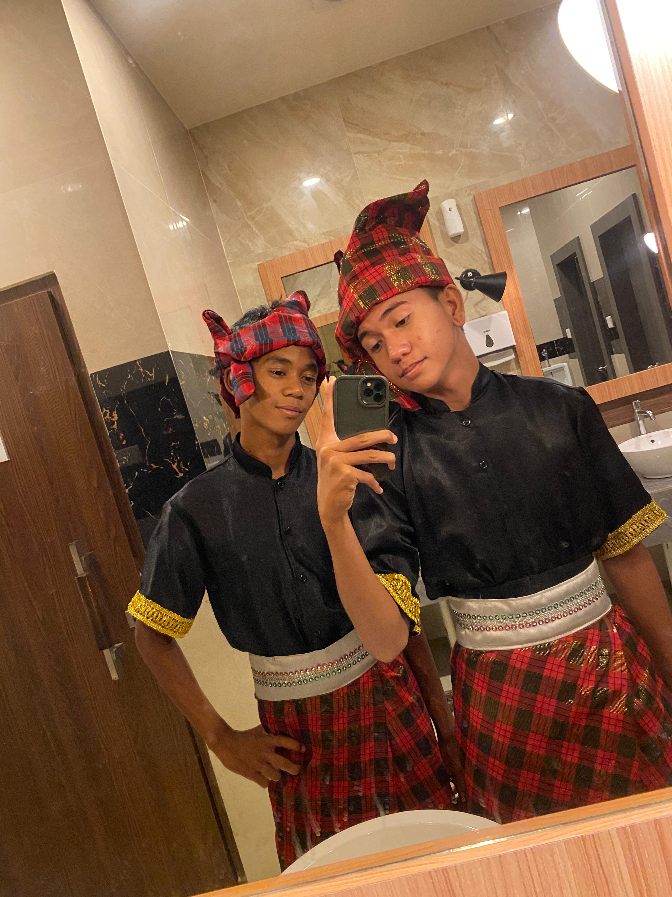
    

  </section>

  <footer>
    
© 2025 SASTIK - Sanggar Seni Tiga Kendari.

  </footer>

  
  
  <canvas id="bintang"></canvas>

  
  
</body>
</html>
